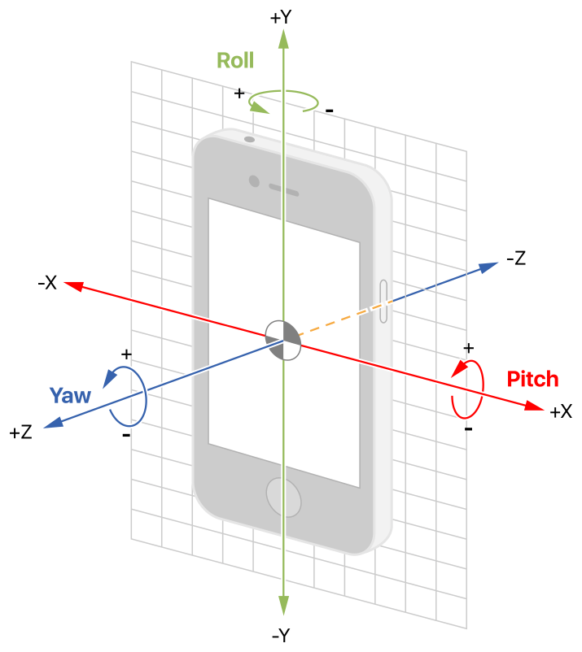
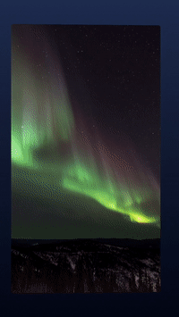
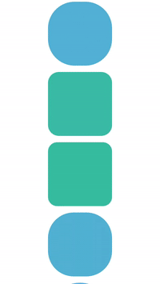

[](https://travis-ci.org/shoheiyokoyama/Gemini)
[](http://cocoapods.org/pods/Gemini)
[](http://cocoapods.org/pods/Gemini)
[](http://cocoapods.org/pods/Gemini)

# Overview


## What is the `Gemini`?

`Gemini` is rich scroll animation framework for iOS, written in Swift. You can easily use `GeminiCollectionView`, which is a subclass of `UICollectionView`.

You available multiple animation has various and customizable properties, and moreover can create your own custom scroll animation. 

`Gemini` also provide a fluent interface based on method chaining. you can use this intuitvely and simply.


```swift
collectionView.gemini
    .circleRotationAnimation()
    .radius(400)
    .rotateDirection(.clockwise)
```

# Features


- [x] Rich animation with scrolling
- [x] Easily usable
- [x] Highly customizable
- [x] Several types of animations and properties
- [x] Support vertical and horizontal flow layout
- [x] Support easing function
- [x] Support `Swift3`
- [x] Fluent interfaces based on method chaining
- [x] Compatible with `Carthage`
- [x] Compatible with `CocoaPod`
- [x] Completely Example Project
- [x] Completely `README`
- [x] And More...

# Animation Types and properties
You available following animation types.

- [Cube](#cube)
- [Circle Rotation](#circle-rotation) You can configure rotation direction using the `CircleRotationDirection`
- [3D vector rotation](#3d-vector-rotation) Each rotation types provide multiple rotation effect
  - [Roll Rotation](#roll-rotation)
  - [Pitch Rotation](#pitch-rotation)
  - [Yaw Rotation](#yaw-rotation)
- [Scale](#scale)
- [Custom](#custom) You can create your own custom scroll animation using multiple properties, rotation, scale, translation, etc.

In addition, you can also customize the following properties.

- BackgroundColor
- Shadow Effect 
- CornerRadius
- Alpha

## <a name="cube"> Cube

<p align="center">
  
  
</p>

Cubic animation like Instagram.
If you want to customize the cube animation, change `cubeDegree`. When the `cubeDegree` is 90 degree, animate like a regular hexahedron.

```swift
collectionView.gemini
    .cubeAnimation()
    .cubeDegree(90)
```

## <a name="circle-rotation"> CircleRotation

<p align="center">
  
  
</p>

A animation is like circle rotation. You can change `circleRadius` and `CircleRotationDirection`.

```swift
collectionView.gemini
    .circleRotationAnimation()
    .radius(450) /// The radius of the circle
    .rotateDirection(.clockwise) /// Direction of rotation. 
```

## <a name="3d-vector-rotation"> 3D vector rotation

You available rotation animation types `Roll`, `Pitch` and `Yaw`. These rotation animation are designed based on 3-Dimensional vector. Figure-1 shows direction of rotation in based on device.

###### ***Figure-1*** Pitch, roll, and yaw axes ######
<p align="center">
  
</p>

Reference: [Event Handling Guide for UIKit Apps](https://developer.apple.com/library/content/documentation/EventHandling/Conceptual/EventHandlingiPhoneOS/HandlingProcessedDeviceMotionData.html#//apple_ref/doc/uid/TP40009541-CH27-SW1)

Each rotation animation types has `RotationEffect`. e.g. `PitchRotationEffect`

Customize `RotationEffect` (`up`, `down`, `sineWave`, `reverseSineWave`, etc.)

### <a name="roll-rotation"> Roll Rotation

<p align="center">
  
  
</p>

### <a name="pitch-rotation"> Pitch Rotation

<p align="center">
  
  
</p>

### <a name="yaw-rotation"> Yaw Rotation

<p align="center">
  
  
</p>

## <a name="scale"> Scale

<p align="center">
  
  
</p>

## <a name="custom"> Custom

<p align="center">
  
  
</p>


# Usage

1. ***Use Gemini classes***

`Gemini` is designed to be easy to use. Use `GeminiCollectionView` and `GeminiCell`. These classes is subclass of `UICollectionView`, `UICollectionViewCell`.

2. ***Configure animation***
Configure animation with fluent interface based on method chaining. You can develop expressive code that enhances readability.

3. ***Call function for animation***

Finally, call `animateVisibleCells()` in `scrollViewDidScroll(_:)`

> NOTE: If you want to adapt animation immediately after view is displayed, call `animateCell(_:)` in `collectionView(_:cellForItemAt:)` and `collectionView(_:willDisplay:forItemAt:)`.


```swift
/// Import Gemini
import Gemini

/// Inherite GeminiCell
class CustomCell: GeminiCell {
...


class CustomViewController: UIViewController: UICollectionViewDelegate, UICollectionViewDataSource {

    /// Inherite GeminiCollectionView
    @IBOutlet fileprivate weak var collectionView: GeminiCollectionView!

...

    /// Configure animation and properties
    func configureAnimation() {
        collectionView.gemini
            .circleRotationAnimation()
            .radius(400)
            .rotateDirection(.clockwise)
    }

    /// Call animation function
    func scrollViewDidScroll(_ scrollView: UIScrollView) {
        collectionView.animateVisibleCells()
    }

    func collectionView(_ collectionView: UICollectionView, willDisplay cell: UICollectionViewCell, forItemAt indexPath: IndexPath) {
        if let cell = cell as? GeminiCell {
            self.collectionView.animateCell(cell)
        }
    }

    func collectionView(_ collectionView: UICollectionView, cellForItemAt indexPath: IndexPath) -> UICollectionViewCell {
        let cell = collectionView.dequeueReusableCell(withReuseIdentifier: "CustomCell", for: indexPath) as! CustomCell
        self.collectionView.animateCell(cell)
        return cell
    }
```

See [Example](https://github.com/shoheiyokoyama/Gemini/tree/master/Example/Gemini), for more details.

To run the example project, clone the repo, and run `pod install` from the Example directory first.

## Requirements

## Installation

Gemini is available through [CocoaPods](http://cocoapods.org). To install
it, simply add the following line to your Podfile:

```ruby
pod "Gemini"
```

## Author

shoheiyokoyama, shohei.yok0602@gmail.com

## License

Gemini is available under the MIT license. See the LICENSE file for more info.
